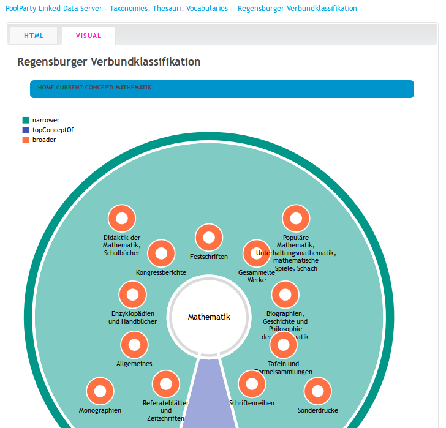

{height=70%}

# Konvertierung nach SKOS/RDF

* Einfach möglich mit dem Kommandozeilenprogramm `mc2skos`
* Entwickelt an der UB Oslo für DDC u.A. Systeme
* MARC21 Classification & Authority nach SKOS und JSKOS

~~~
sed 's/n||aznnnabbn/aa|aznnaabbn/' \
    < rvko_marcxml_2017_3.xml \
    > rvko_marcxml_2017_3-fixed.xml

mc2skos --scheme http://example.org/rvk \ 
        --uri 'http://example.org/rvk/{object}' \
        --indexterms \
        rvko_marcxml_2017_3-fixed.xml
~~~

* Aufruf noch einfacher wenn offizielle RVK-URI feststehen

---

MARC21 Classification                       RDF
------------------------------------------- -------------------
`001` Control Number                        `dct:identifier`
`003` Control Number Identifier             - (`DE-625`) 
`005` Date and time of latest transaction   `dct:modified`
`008` Date entered on file                  `dct:created`
`040` Record Source                         - (`DE-625`)
`084` Classificaton Scheme and Edition      `skos:inScheme`
`153` Caption                               `skos:prefLabel`
`153` Classification number hierarchy       `skos:broader`
`253` Complex See Reference                 `skos:editorialNote`
`684` Auxiliary Instruction Note            `skos:editorialNote`
`700` Index Term-Personal Name              `skos:altlabel`
`710` Index Term-Corporate Name             `skos:altlabel`
`711` Index Term-Meeting Name               `skos:altlabel`
`750` Index Term-Topical                    `skos:altlabel`
`751` Index Term-Geographic Name            `skos:altlabel`

# Noch offen: Aufbau der URIs

* Basis-URI

    * <http://example.org/rvk/>
    * <http://rvk.uni-regensburg.de/id/>
    * ...
    * *sollte auch RDF liefern*

* Mit Notation

    * <http://example.org/rvk/AA>
    * <http://example.org/rvk/AA-09900>
    * <http://example.org/rvk/AA-10000-AA-19900>

* Mit Datensatz-ID (MARC 001)

    * <http://example.org/rvk/2:>
    * <http://example.org/rvk/3:>
    * <http://example.org/rvk/4:2641>
    * *noch nicht 100% umgesetzt, da ID-Lookup notwendig*

# Zusammenfassung

Um die offene Nutzung der RVK zu ermöglichen:

* Freigabe klären (CC0 o.Ä.)
* Aufbau der URIs klären
* Konvertierung von MARCXML nach (J)SKOS
* Im Idealfall Auflösung der URIs (Redirect, RVK-API o.Ä.)
 
